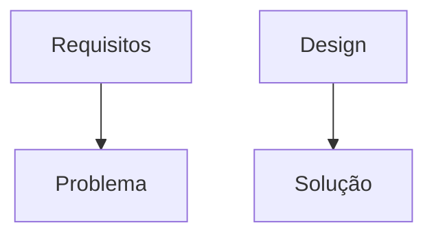

# O que é software?
Software é um conjunto de modelos em diferentes níveis de abstração que representam de diferentes formas um conceito complexo capaz de processar informações para um intuito específico. O próprio código-fonte é apenas um dos modelos de software possíveis.

# O que é modelagem de software?
Modelagem de software é a criação de modelos que, partindo do alto nível, vai se refinando e refinando cada vez mais para chegar em níveis menos abstratos que se comunicam com o computador. A qualidade desses modelos é essencial para transmitir a intenção de qualidade do software no alto nível para o baixo nível.
Modelos giram muito em torno dos **requisitos de software** e do **design de software**, de forma que o domínio de cada um desses aspectos tem um domínio próprio: os requisitos são mais voltados para especificar o problema e o design para trazer a solução. A linguagem é a ferramenta utilizada para criar esses modelos.

# O construto modelo
Construtos são conceitos abstratos complexos que são formados por outros conceitos e que não possuem um referencial direto no mundo real, que são impossíveis de medir, observar, apalpar.