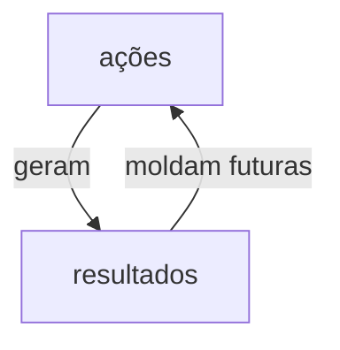

# Definição

Systems thinking é uma linha de pensamento que pode munir uma pessoa de ferramentas e metodologias que irão oferecer uma abordagem que facilita a resolução de problemas e análise de um sistema. Não é algo propriamente metódico, não é algo que especifica uma forma certa de resolver problemas, mas uma linha de pensamento que entrega uma perspectiva mais apropriada pra lidar com sistemas. Um conjunto de coisas que, aí sim, são propriamente metódicas.

Systems thinking deve ser usado quando:
- se trata de um assunto importante
- se trata de um problema crônico
- se trata de um problema familiar e já tem histórico
- se trata de um problema que tentaram resolver antes sem sucesso

# Conceitos fundamentais

## Interconexão

Systems thinking requer que paremos de pensar nas coisas de forma linear e passemos a pensar de forma circular, como em um ciclo, onde diferentes elementos são interligados e interdependentes, assim como na biologia.

## Síntese

A síntese diz respeito ao processo de, dos vários elementos visualizáveis a partir da pormenorização de um sistema, transformar esses elementos em componentes gerenciáveis/manuseáveis. É sobre conseguir enxergar ainda além de uma visão holística, compreender tanto o todo como as partes.

## Emergência

Conceitos do systems thinking e da [[Teoria Geral dos Sistemas]] estão profundamente atrelados à biologia. Emergência é sobre como as coisas surgem. Na biologia, o surgimento da vida se dá à combinação de diversos elementos do sistema formando uma condição ideal para gerar à vida. É o resultado dessa **combinação**. Da mesma forma, a combinação e interação entre as partes de um sistema.

## Ciclos de Feedback

Uma vez que tudo está interconectado em um sistema e não existem partes avulsas, é natural que existam fluxos de interação entre essas partes. Entender essa dinâmica pode fornecer um insight melhor sobre como intervir nesses fluxos.
Esses ciclos podem ser de reforço ou de balanceamento. Ciclos de reforço são aqueles que reforçam alguma ideia ou alguma parte dentro do sistema, análogo à proliferação de coelhos na biologia, ao passo que ciclos de balanceamento funcionam para manter homeostase dentro de um sistema. 

## Causalidade

Causalidade é um conceito que, quando entendido, permite que entendamos em um sistema como as coisas se influenciam num sistema para chegar ao ponto que chegaram.

## Mapeamento de Sistemas

Mapeamento de sistemas é uma prática/ferramenta dos adeptos do system thinking para identificar os elementos dentro do sistema e representar de alguma forma mais visual como eles se interconectam, se relacionam e agem.

Existem diferentes tipos de mapeamento.

- Diagrama de sistemas
- Bússola
- Gráfico de comportamento
- Diagrama do ciclo causal
- Arquétipo do sistema

